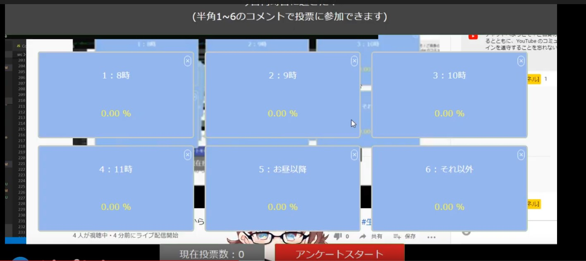
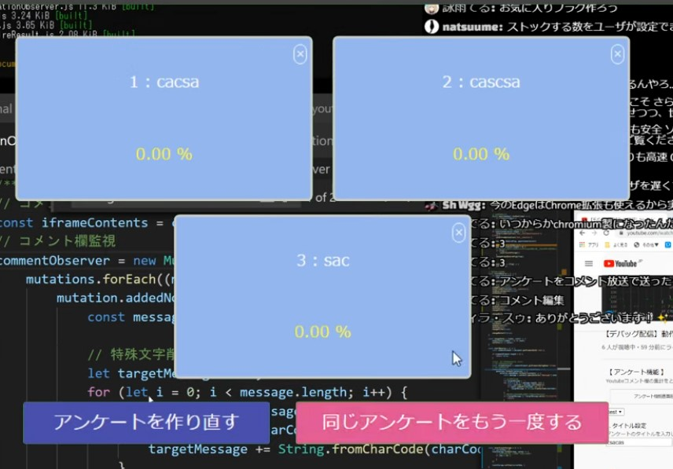
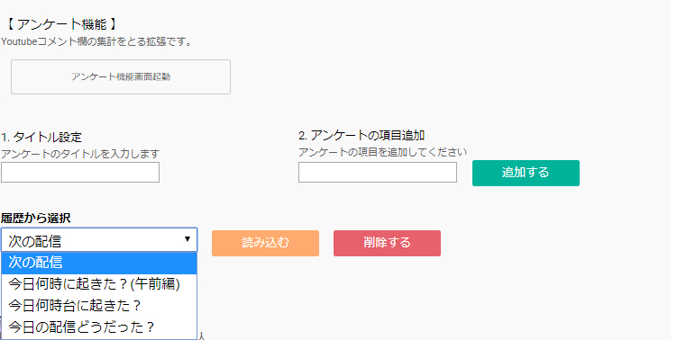

# つべアンケ
Youtube画面内でアンケートができるchrome extensionsです。

- [chrome extensions](https://chrome.google.com/webstore/detail/%E3%81%A4%E3%81%B9%E3%82%A2%E3%83%B3%E3%82%B1/pdiliohipapmhedahgimljfpaimdaapi)

- [firefox addon](https://addons.mozilla.org/ja/firefox/addon/%E3%81%A4%E3%81%B9%E3%82%A2%E3%83%B3%E3%82%B1/?src=search)

youtube.com/watch?v=* 配下で実行されます。
拡張がうまく読み込まれなかった場合はページ更新してください。

アンケート基本注意事項
- アンケート項目は2個以上入力しないとアンケート開始できない
- アンケート項目の半角数字のみ集計
- コメント欄は自動スクロールが適用されている状態で実施してください（集計ができなくなります）
- 1回のアンケート中は1ユーザ1度のみ投票可能（上書きはされない）
- 別動画/生放送へジャンプした場合、アンケート前でも途中でも設定項目はすべてリセットされる
- 動画、アーカイブ上ではこの拡張は表示されない
- 自身の投票も可能

version2.1.0より履歴保存が可能になりました(localStorageでの管理のため、シークレットウィンドウや別ブラウザとの履歴共有では利用できません)

**※あくまで拡張なので、アンケート結果に絶対的信頼をおかないでください**

# build
    npm run build

# Preview

