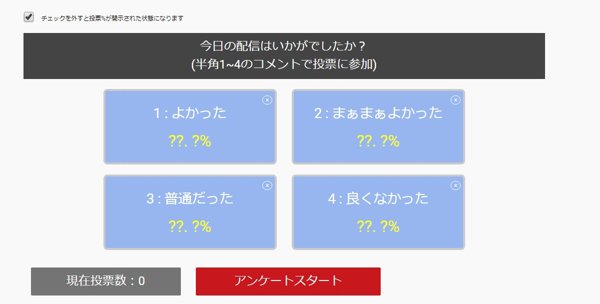

# つべアンケ

Youtube画面内でアンケートができるchrome extensionsです。

youtube.com/watch?v=* 配下で実行されます。
拡張がうまく読み込まれなかった場合は更新してください。

アンケート基本注意事項
- アンケート項目は2個以上入力しないとアンケート開始できない
- アンケート項目の半角数字のみ集計
- コメント欄はポップアウトしない状態かつ、自動スクロールが適用されている状態で実施してください（集計ができなくなります）
- 1回のアンケート中は1ユーザ1度のみ投票可能（上書きはされない）
- 別動画/生放送へジャンプした場合、アンケート前でも途中でも設定項目はすべてリセットされる
- 動画、アーカイブ上ではこの拡張は表示されない
- 自身の投票も可能

**※あくまで拡張なので、アンケート結果に絶対的信頼をおかないでください**

# Preview

# build
    npm run build

